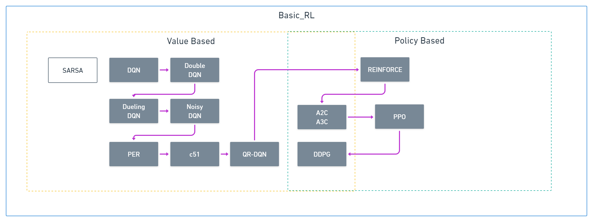

# BNM2h
## Introduction
강화학습으로 만난 열정 넘치는 분들과 함께하는 Study Group BNM2h 입니다.

:umbrella:비(B)가오나 :snowflake:눈(N)이오나 :date:매(M)일 :hourglass_flowing_sand:2(h)시간! 강화학습과 함께합니다.

공부하면서 기록을 목적으로 Repository를 잘 키워나가보려고 합니다.:seedling:

Study를 하면서 작성된 code들은 많은 reference들과 책들을 참고하여 Pytorch로 작성되었습니다.

많은 응원과 관심 부탁드립니다:blush:

## Members :busts_in_silhouette:
* @curieuxjy 
* @Rackhun
* @11wooa
* @jeongeun980906
* @LeejwUniverse

## Study Road :paw_prints:

|Algorithm|thanks to|code|memo|
|-|-|-|-|
|DQN|-|-|-|
|REINFORCE|-|-|-|
|A2C|@Rackhun|[code](./pytorch-DS-051/rackhun/1_A2C_pendulum/)]|-|
|A3C|-|-|-|-|
|DDPG|@LeejwUniverse|[code](./pytorch-DS-051/jungwoo/DDPG_Pendulum.ipynb)|-|

## Study Books :books:
> Study에서 공부한 순서대로 작성되었습니다.
|Name|저자|출판사|github link|Duration|
|-|-|-|-|-|
|PyTorch를 활용한 강화학습/심층강화학습 실전 입문|오가와 유타로 지음/심효섭 옮김|위키북스|[github](https://github.com/wikibook/pytorch-drl)|2020.02.23~2020.03.31|
|수학으로 풀어보는 강화학습 원리와 알고리즘|박성수 지음|위키북스|[github](https://github.com/pasus/Reinforcement-Learning-Book)|2020.03.31~|

## Study Reference(Thanks to GOOD repositories!)
* [RL-Adventure](https://github.com/higgsfield/RL-Adventure)
* [RL-Adventure-2](https://github.com/BNM2h/RL-Adventure-2)
* [Reinforcement-Learning-Book](https://github.com/Yeachan-Heo/Reinforcement-Learning-Book)

